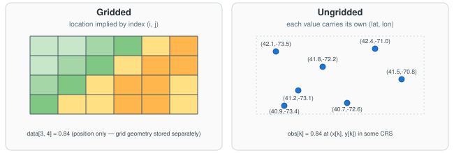
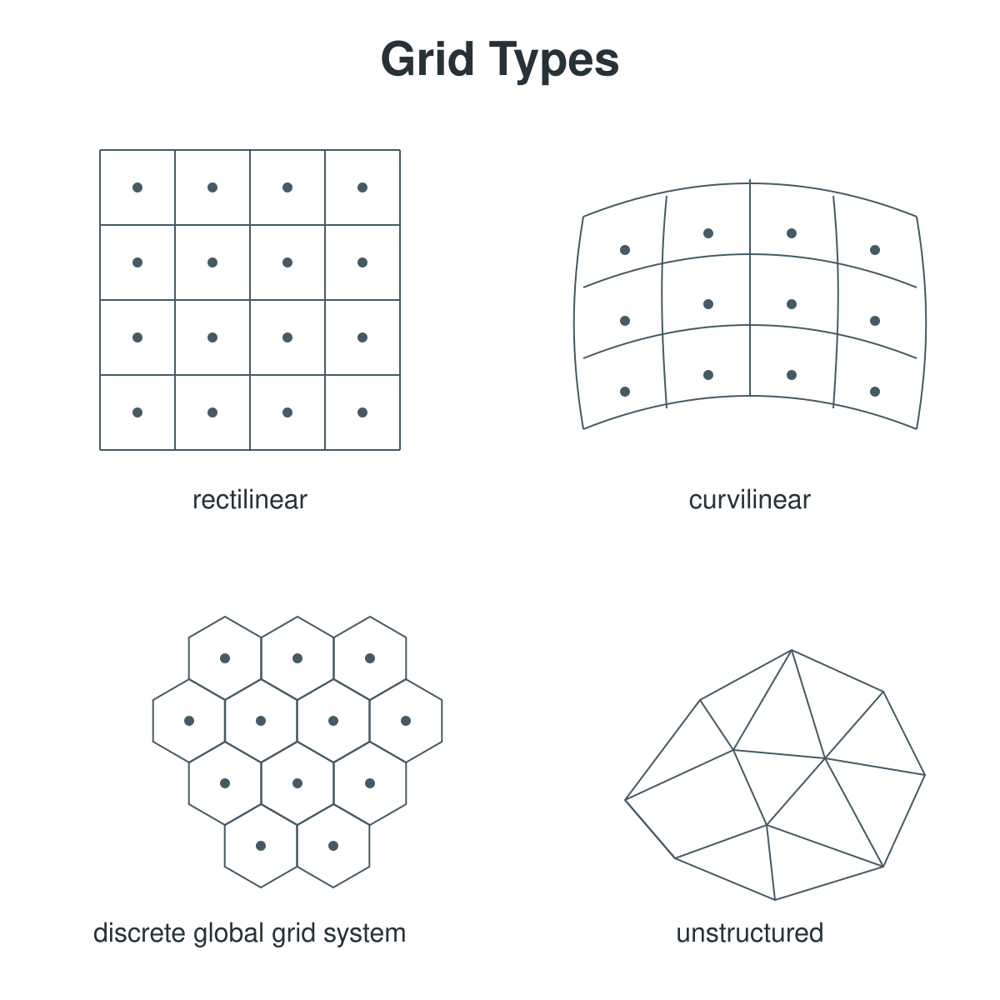

# Data structures

This page defines the data-representation concepts the rest of the guide leans
on. Two orthogonal axes — *gridded vs. ungridded* and *structured vs.
unstructured* — set up the vocabulary, **regridding** is the operation that
moves data between them, and a **datacube** is the analysis-ready destination.

Reference material on satellite product taxonomy (swath geometry, analysis-ready
data specifications, agency processing-level schemes) is out of scope here — see
the glossary's
[Satellite data products](../glossary.md#satellite-data-products) section,
whose entries link to canonical external references.

## Two spaces

Most of what follows describes the relationship between two distinct spaces:

- **Index space** — the integer-indexed structure of the array itself. A value
  is addressed by its position `(i, j[, k])`. Has no inherent units.
- **World space** (also "physical space" or, in geospatial work, "geographic
  space") — where each value actually sits in a [CRS](../glossary.md). Has
  units (meters, degrees, kelvin-along-a-vertical-axis, …) defined by the CRS.

**Gridded** data is data that has both spaces, plus a mapping between them
(the "grid geometry"). **Ungridded** data lives only in world space, with no
index space at all — each record carries its own world-space coordinates.

## Gridded vs. ungridded

The first question to ask of any dataset: **is it on a grid at all?**

- **Gridded** data lives in **both** index space and world space, with the
  mapping between them — the "grid geometry" — stored separately from the
  values. The mapping can one of three common forms:
    - an **affine transform plus a CRS** — the GeoTIFF / COG convention.
      `(x, y) = affine @ (i, j)`; **no per-cell coordinate arrays stored**.
    - **1-D coordinate arrays per axis** for a regular grid (`x[nx]`, `y[ny]`)
      — the CF / NetCDF / Zarr convention.
    - **2-D coordinate arrays per cell** for a curvilinear grid
      (`x[i, j]`, `y[i, j]`).

    Examples: a satellite Level-3 product on a regular lat/lon grid, a
    climate-model output, a reanalysis dataset, a COG.

- **Ungridded** data lives **only in world space** — no index space, no array
  structure. Each value carries its own coordinates `(x[k], y[k])` in whatever
  CRS the producer chose (geographic *or* projected). There's no row `i` and
  column `j`, only individual observations. Examples: weather stations, ocean
  buoys, GNSS receivers, lidar/GPS point clouds, in-situ vertical profiles,
  aircraft tracks.

{ width="100%" }

The same physical quantity (say, surface temperature) can be represented either
way. Ungridded observations are often the *input* to a regridding step that
produces a gridded product (see [Regridding](#regridding-resampling) below).

## Structured vs. unstructured

A second, *orthogonal* axis applies to gridded data: **how is cell connectivity
defined?** This axis says nothing about ungridded data — ungridded data has no
grid topology at all.

- **Structured grid:** cells form a regular logical array addressable by integer
  indices `(i, j[, k])`; **connectivity is implicit** (neighbors of `(i, j)`
  are `(i±1, j)` and `(i, j±1)`). Includes **regular** (rectilinear) grids and
  **curvilinear** grids — logically rectangular but physically warped, common in
  ocean models.
- **Unstructured grid (mesh):** cells (triangles, polygons, sometimes mixed) are
  joined by an **explicit connectivity list**; nodes have variable numbers of
  neighbors. Examples: ICON, MPAS, FVCOM, finite-element meshes. Storage and
  access patterns are fundamentally different from structured grids.
- **Discrete Global Grid Systems (DGGS):** a third option that doesn't fit
  neatly into structured-vs-unstructured. A DGGS tiles the *whole* sphere with
  a single (often equal-area) cell family and a hierarchical refinement scheme;
  cells are addressed by a **specialized cell ID**, with connectivity and
  refinement encoded in the ID's arithmetic — no `(i, j)` array shape, and no
  explicit connectivity list. Examples: **HEALPix** (equal-area quadrilateral
  cells with ring/nested indexing), **H3** (hexagonal cells with a hierarchical
  hex ID), **S2** (quadrilateral cells on a cubed sphere), **rHEALPix**,
  **cubed-sphere**. Standardized by the
  [OGC DGGS abstract specification](https://www.ogc.org/standards/dggs/).

{ width="100%" }

The two axes combine: a dataset can be **gridded + structured** (most satellite
Level-3 products), **gridded + unstructured** (an ocean-model output on a
triangular mesh), **gridded + DGGS** (a HEALPix cosmology map; an H3 hex map),
or **ungridded** (irrelevant to this axis — there's no grid).

## Regridding / resampling

**Regridding** (or **resampling**) is the operation that moves data from one
spatial sampling to another — from ungridded or unstructured input onto a
regular grid, or between two grids. It is the verb connecting the preceding
nouns to the datacube that follows. The previous section's diagram, read
right-to-left, illustrates the simplest case: scattered ungridded points
resampled onto a regular grid.

The choice of **interpolation method** matters more than people expect:

| Method | Behavior | Use for |
|---|---|---|
| **Nearest** | Picks the closest source value; preserves values exactly; blocky. | Categorical / class data (land cover, flags). |
| **Bilinear** (linear) | Weighted average of the four surrounding cells; smooth; blurs sharp edges. | Smooth continuous fields (temperature, reflectance). |
| **Conservative** | Area-weighted; preserves area-integrated totals across cells. | Extensive quantities — fluxes, precipitation, mass. |

A useful rule of thumb: **match the method to the quantity.** The wrong choice
silently corrupts downstream analysis — bilinear on precipitation does not
conserve total water; nearest on a categorical mask preserves classes but
bilinear on the same mask produces nonsense fractional categories.

Common Python tooling: **`xESMF`** (xarray-friendly, supports conservative
regridding via ESMF), **`pyresample`** (especially for swath → grid),
**`rasterio.warp.reproject`** (GDAL-backed, the GeoTIFF/COG path),
**`scipy.interpolate`** for one-off cases.

For empirical performance trade-offs across these tools, see Development Seed's
[warp/resample profiling benchmark][warp-resample-profiling], which measures
memory and time across local vs. S3 storage and NetCDF, Zarr, and GeoTIFF
sources.

[warp-resample-profiling]: https://developmentseed.org/warp-resample-profiling/

## Datacube

A **datacube** is a labeled, regularly-gridded N-dimensional array — dimensions
carry coordinates (e.g. `time`, `level`, `lat`, `lon`, `band`), and the data is
addressable by those coordinates rather than only by integer index. Typical
sizes span 3–5 dimensions.

A datacube is inherently a **structured, gridded** representation. It is most
often the *product* of gridding either ungridded or unstructured-mesh data onto
regular grids — i.e. the destination of the previous section's operation.
Common containers include Zarr (cloud-optimized), NetCDF, and HDF5; the
in-memory representation is typically an Xarray `Dataset` when using Python.

For a deeper look at how a datacube's dimensions reduce to common viewing
shapes (maps, time series, profiles, animations), see the
[visualization overview](../visualization/overview.md).

{ width="100%" }

## External references

- **UGRID conventions** (unstructured-mesh in NetCDF):
  <https://ugrid-conventions.github.io/ugrid-conventions/>
- **CF conventions:** <https://cfconventions.org/>
- **xESMF** (regridding for xarray): <https://xesmf.readthedocs.io/>
- **pyresample** (geospatial resampling): <https://pyresample.readthedocs.io/>
- **Open Data Cube:** <https://www.opendatacube.org/>
