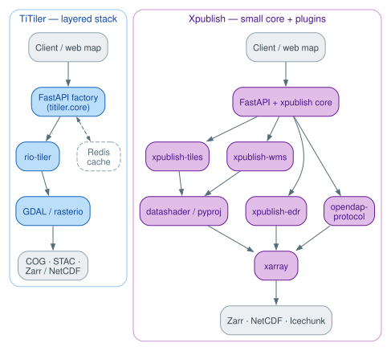
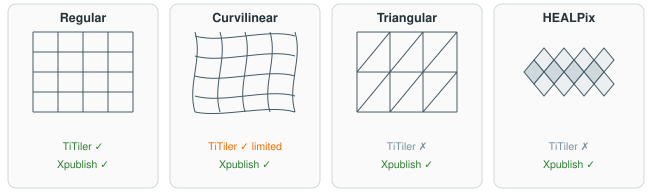

# Dynamic tiling ecosystem comparison

This page compares the two main [FastAPI](https://fastapi.tiangolo.com)-based ecosystems for serving Zarr-backed datacubes as tiles: **[TiTiler](https://github.com/developmentseed/titiler)** ([Development Seed](https://developmentseed.org)) and **[Xpublish](https://github.com/xpublish-community/xpublish)** with its plugins (the [xpublish-community](https://github.com/xpublish-community) org, [Earthmover](https://earthmover.io), and the wider [xarray](https://xarray.dev) community). For per-ecosystem detail see the [TiTiler ecosystem overview](titiler/overview.md) and the [Xpublish ecosystem overview](xpublish/overview.md). For the client-side equivalent (visualization libraries that bypass a tile server entirely), see the [client-side rendering comparison](client-side-comparison.md).

!!! tip "Which should I use?"

    - **TiTiler** — COG/STAC-first, GDAL-native raster, fast cold start, and a mature cloud-deploy story (Docker, Lambda/ECS). Reach for it when your data is regular or projected raster, or when you need [NASA CMR](https://cmr.earthdata.nasa.gov/search/) or [ESA EOPF](https://eof.esa.int/eopf/) integrations.
    - **Xpublish** — xarray-native, with first-class support for irregular grids (curvilinear, triangular FVCOM, HEALPix, cubed-sphere) and a pick-your-protocol plugin model (tiles, WMS, OGC EDR, OPeNDAP). Reach for it for operational scientific data on its native grid.

    TiTiler is intended for public-facing slippy-map tiles. Xpublish for research access to the same data on native grids.

## Summary

| | [TiTiler »](titiler/overview.md) | [Xpublish »](xpublish/overview.md) |
|---|---|---|
| Maintainer | [Development Seed](https://github.com/developmentseed) | [`xpublish-community`](https://github.com/xpublish-community) (Joe Hamman, Alex Kerney); code © UCAR; [`xpublish-tiles`](https://github.com/earth-mover/xpublish-tiles) by Earthmover |
| Shape | Layered Python stack: [`rio-tiler`](https://github.com/cogeotiff/rio-tiler) → [`titiler.core`](https://github.com/developmentseed/titiler) → [`titiler.xarray`](https://github.com/developmentseed/titiler/tree/main/src/titiler/xarray) → applications ([`titiler.application`](https://github.com/developmentseed/titiler/tree/main/src/titiler/application), [`titiler-cmr`](https://github.com/developmentseed/titiler-cmr), [`titiler-multidim`](https://github.com/developmentseed/titiler-multidim), [`titiler-eopf`](https://github.com/EOPF-Explorer/titiler-eopf)) | Small `xpublish` core with independent plugins ([`xpublish-tiles`](https://github.com/earth-mover/xpublish-tiles), [`xpublish-wms`](https://github.com/xpublish-community/xpublish-wms), [`xpublish-edr`](https://github.com/xpublish-community/xpublish-edr), [`opendap-protocol`](https://github.com/xpublish-community/opendap-protocol)) |
| Dataset identity | Client-supplied per request: `?url=…` on generic endpoints (`titiler-eopf`/`titiler-cmr` are path/search exceptions) | Server-published namespace: `/datasets/{id}/…`, ids resolved server-side |
| Rendering engine | [`rio-tiler`](https://github.com/cogeotiff/rio-tiler) + [GDAL](https://gdal.org)/[rasterio](https://rasterio.readthedocs.io) | [Datashader](https://datashader.org) |
| Primary inputs | [COG](https://www.cogeo.org), [STAC](https://stacspec.org); [Zarr](https://zarr.dev)/[NetCDF](https://www.unidata.ucar.edu/software/netcdf/)/[Icechunk](https://icechunk.io) via `titiler.xarray` | Xarray-native: [Zarr](https://zarr.dev) (primary), [NetCDF](https://www.unidata.ucar.edu/software/netcdf/), [Icechunk](https://icechunk.io) |
| Grid topologies | Regular and projected lat/lon are first-class; curvilinear limited; unstructured out of scope | Regular, curvilinear, FVCOM triangular, SELFE, 2D non-dimensional, [HEALPix](https://healpix.sourceforge.io), cubed-sphere, polar |
| Reprojection | GDAL warp (full kernel set) | Custom [pyproj](https://pyproj4.github.io/pyproj): separable 4326→3857 fast path, blocked thread-pool transform for general CRS |
| Tile endpoints | XYZ, WMTS, TileJSON, POST `/statistics`; no vector tiles | XYZ, WMTS, OGC Tiles 1.0, full WMS, MVT/GeoJSON vector tiles, OGC EDR, OPeNDAP |
| Conventions | CF via [rioxarray](https://github.com/corteva/rioxarray) (basic), STAC native | CF via [`cf-xarray`](https://github.com/xarray-contrib/cf-xarray) (full), `flag_values`/`flag_meanings`/`flag_colors` for categorical, no STAC |
| Caching | [Redis](https://redis.io) (dataset-level) | Plugin-configurable; `xpublish-tiles` keys on `_xpublish_id` + dim + variable |
| First request | Fast | Slow (Numba JIT; warm-up required) |
| Deployment | Official [Docker](https://www.docker.com) images, [AWS Lambda](https://aws.amazon.com/lambda/)/[ECS](https://aws.amazon.com/ecs/) [CDK](https://aws.amazon.com/cdk/) examples | No official images; deployment is hands-on |
| License | MIT | Apache 2.0 |

## How they differ

The deeper detail lives on the per-ecosystem pages (linked from the table headers and under [Related](#related)); this section covers only the contrasts that don't belong to either page on its own.

**Structure.** TiTiler is a vertically layered stack — `rio-tiler` and `titiler.core` at the base, `titiler.xarray` adding Zarr/NetCDF, opinionated applications on top — with a COG-first lineage that shows up as GDAL-native raster handling, STAC integration, and a deep set of cloud-deploy recipes. Xpublish is a small core plus independent, mix-and-match plugins (tiles, WMS, EDR, OPeNDAP), centered on xarray-native scientific data and the irregular grid topologies operational geoscience uses.

{ width="100%" }

**Who names the dataset.** This is the difference that drives deployment and security. TiTiler takes the data location as a per-request query parameter (`?url=…`) on generic, stateless endpoints, so any worker serves any request and the service drops onto Lambda/ECS behind a CDN — at the cost of exposing the location in the URL and an open fetch surface that needs allowed-host limits. Xpublish publishes a server-owned namespace (`/datasets/{id}/…`) resolved server-side, so the dataset is curated by the operator and stays resident in the process — which is what enables its `_xpublish_id` caching and stateful EDR/OPeNDAP queries, at the cost of stateful replicas that must share the same registry. (`titiler-eopf` and `titiler-cmr` are path/search exceptions to TiTiler's query-parameter model.)

**Rendering engine.** The engines mirror that split. TiTiler renders through GDAL via `rio-tiler` (full resampling kernels, band-math `expression`s, fast cold start). Xpublish-tiles renders through [Datashader](https://datashader.org) with [Numba Just-in-Time (JIT)](https://numba.pydata.org/numba-doc/dev/reference/jit-compilation.html) and a custom [pyproj](https://pyproj4.github.io/pyproj) reprojection — a slow first request in exchange for renderers that handle curvilinear, triangular, and other unstructured grids GDAL can't, picking an engine per grid type.

{ width="100%" }

## Picking the right tool

- **COG and STAC** are the design center, or you need a mix of raster formats from one stack: **TiTiler**.
- **Operational scientific data on irregular grids** (FVCOM, SELFE, ROMS curvilinear, HEALPix, ICON triangular): **Xpublish** with `xpublish-tiles` and/or `xpublish-wms`.
- **OGC EDR queries** (position/area/cube extraction, time-series, profiles): **Xpublish** with `xpublish-edr`.
- **OPeNDAP** clients: **Xpublish** with `opendap-protocol`.
- **Categorical raster styling** from CF `flag_values`/`flag_meanings`/`flag_colors`, vector tiles, or a legend endpoint: **Xpublish-tiles**.
- **NASA CMR** or **ESA EOPF** data: **TiTiler** via `titiler-cmr`, or `titiler-eopf` respectively.
- **Dynamic tiling of xarray-readable stores (Zarr, NetCDF)**: `titiler-multidim`

A common hybrid is TiTiler for public-facing slippy-map tiles (where its Redis cache and Lambda/ECS deploy story shine) and Xpublish-tiles/EDR for research-oriented access to the same datasets on their native grids.

## Related

- [Client-side rendering comparison](client-side-comparison.md): browser-side libraries (deck.gl-raster, `@carbonplan/maps`, zarr-layer, zarr-cesium) and viewer apps (Browzarr, GridLook) that read Zarr directly with no tile server.
- [TiTiler ecosystem overview](titiler/overview.md), [Xpublish ecosystem overview](xpublish/overview.md): per-ecosystem detail.
- [Xpublish-tiles detail page](xpublish/xpublish-tiles.md).
