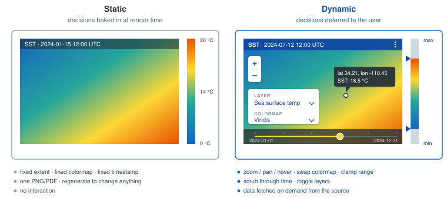
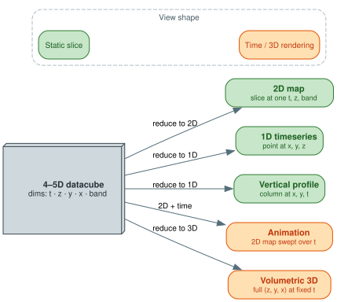
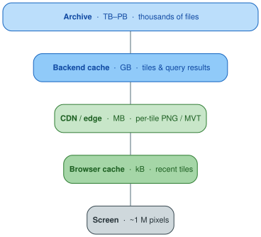
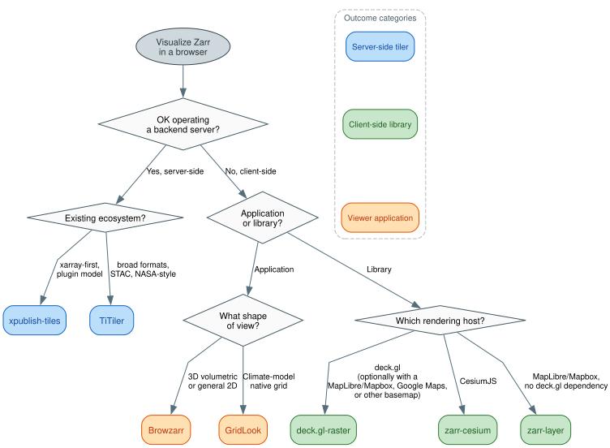

# Overview of datacube visualization

Datacube visualizations can be sub-divided into two categories: static and dynamic. The contents of a static visualization do not change after creation, similar to printing a map to a piece of paper. Dynamic visualizations respond to user input. For example, a user could change the visualization by zooming in, panning to a different location, or changing the color scheme. This explanation focuses on dynamic visualizations.

## What does it take to dynamically visualize data?

- Rendering engine: A library that displays the data, commonly consisting of a graphics context (e.g., WebGL, SVG, or DOM elements), drawing primitives (points, lines, shapes, textures, meshes), and coordinate systems (e.g., screen space, world space, data space transformations).
- Framework: Rather than interacting with a rendering engine directly, developers often use frameworks that provide helpful abstractions. Frameworks typically handle layer management and composition, efficient data binding and updates, built-in interaction patterns, and performance optimizations like culling and batching. Geospatial examples include deck.gl and MapLibre/Mapbox GL JS.
- Data source(s): The data sources for the visualization may be hosted on the site or delivered by a backend server.
- Backend services: The backend services take requests from the user interface and provide well-formatted responses. This process may involve I/O, format conversion, resampling, aggregation, and computational processing.
- Data orchestration: The data orchestration layer of the user interface manages the flow of data from sources to the visualization framework, handling API integration (such as connecting to STAC catalogs to discover available datasets) and coordination with backend services (like tiling servers that process and serve datacube slices). For example, when a user selects a specific time range and geographic region, the data orchestration layer translates this selection into the appropriate API calls and ensures the resulting data reaches the framework in the correct format.
- User interaction layer: The user interaction layer of the user interface handles direct user interactions and visual feedback. It provides interface controls (such as time sliders, layer toggles, and zoom controls), processes user input events (mouse clicks, touches, keyboard shortcuts), and updates the visualization state accordingly. The interaction layer also manages visual feedback like hover effects, selection highlighting, and loading indicators to keep users informed about the system's response to their actions.

## What makes datacube visualization different?

Dynamic datacube visualizations require more complex considerations than visualizing 1- or 2-D data sources:

- Multi-dimensional structure: The user interaction layer and data orchestration components need to provide the user a way to specify the dimensionality of the visualization (typically choosing to display 1, 2, or 3 dimensions at a time) relative to the dimensionality of the data source (which can commonly be 3-, 4-, or 5-D).
- Complex visualization requests: The range of visualization experiences increases with the dimensionality of the dataset. For example, users will often request animations, time-series, or pseudo-3-D visualizations.
- Large scale data sources: Datacubes can exceed many TBs and consist of data spanning thousands of files, which requires further performance optimizations, backend complexity, and sophisticated caching strategies (tile caches, query result caches, etc.).
- Complexity in data sources: Datacubes may be stored in many different file formats (e.g., GeoTIFF/COG, GRIB, NetCDF, Zarr, etc.) which adds complexity to the backend services. The sources can also span cloud providers (e.g., GCS, AWS) and involve protocols like OPeNDAP.
- Coordinate reference systems (CRS): Datacubes often involve complex coordinate reference system transformations between data coordinates, geographic projections, and display coordinates.
- Temporal considerations: Animation frameworks, temporal interpolation, and playback controls are more complex for datacubes, especially when integrating multiple data sources with different temporal resolutions or misaligned time coordinates.

## Choosing an approach

The Zarr-on-the-web tools documented in this section split along three axes: server-side dynamic tiling vs client-side rendering, library vs viewer application, and (within libraries) which rendering host you target. The decision tree below works through those choices in order.

This section assumes you want a *dynamic* visualization (the data is in Zarr or another cloud-optimized format and you'll render against it on demand). Pre-rendering raster tile pyramids to flat PNGs is technically possible but increasingly an anti-pattern: dynamic tilers behind a CDN match the performance, and pre-rendering forces colormap and styling decisions at generation time, freezes them, and creates a regeneration pipeline to maintain. If you genuinely have a one-shot static visualization that will never change, PMTiles is a reasonable static option, but none of the Zarr-aware tools below apply to that case.

### Short-circuits

A few requirements pin the choice on a single feature, before the tree applies:

| If you need... | Choose | Why |
|---|---|---|
| True 3D volumetric raycasting (not just 3D slices) | [Browzarr](browzarr.md) | Only one with full raycasting via `volFragment.glsl` |
| Animated vector fields (U/V particles) | [zarr-cesium](zarr-cesium.md) | Only one with `cesium-wind-layer` integration |
| Native rendering of HEALPix, ICON triangular, Gaussian-reduced, or rotated lat-lon grids | [GridLook](gridlook.md) | Only one with grid-topology detectors |
| One renderer for both COG and Zarr in the same scene | [deck.gl-raster](deck.gl-raster.md) | Generic `TilesetDescriptor` shared across COG and Zarr backends |
| GeoZarr metadata parsed out of the box (multiscales, CRS as EPSG/WKT2/PROJJSON) | [deck.gl-raster](deck.gl-raster.md) | Only one with an explicit `@developmentseed/geozarr` parser |

### Tree, in words

For users on a non-image-rendering reader:

1. **Operating a backend server is OK?** If yes, see the [server-side comparison](ecosystem-comparison.md) for [TiTiler](titiler/overview.md) vs [xpublish-tiles](xpublish/xpublish-tiles.md). If no, continue client-side.
2. **Application or library?** A pre-built application means pointing a hosted viewer at a Zarr URL: choose [Browzarr](browzarr.md) for general exploration or 3D cubes, or [GridLook](gridlook.md) for non-rectilinear climate-model grids. A library means embed a renderer into your own application: continue.
3. **Which rendering host?** [deck.gl](deck.gl-raster.md) for the deck.gl ecosystem, [CesiumJS](zarr-cesium.md) for a 3D globe, or [zarr-layer](zarr-layer.md) for MapLibre/Mapbox.

[`@carbonplan/maps`](carbonplan-maps.md) is documented for catalog completeness and remains the rendering backbone of CarbonPlan's published visualizations, but for new work it isn't in the recommendation path: it requires data to be pre-baked into Web Mercator `ndpyramid` pyramids, which commits you to a regeneration pipeline and the same frozen-styling trade-offs that pre-rendering normally implies.
