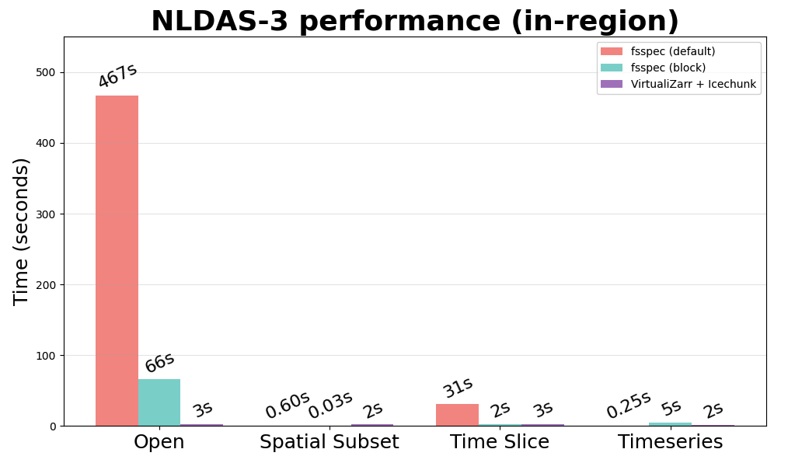

# Default FSSpec caching arguments

FSSpec's default caching behavior is designed for tabular data and performs poorly for datacubes. Recommendations for better better arguments can be found in the [Xarray's tutorial](https://tutorial.xarray.dev/intermediate/remote_data/remote-data.html#remote-access-and-file-caching).

For example, see the figure below from the [Open Source Geospatial Workflows in the Cloud workshop](https://agu2025.workshops.geojupyter.org/modules/data-in-the-cloud/) showing how much slower it is to open a datacube via `xarray.open_mfdataset()` when using the default readahead fsspec caching mechanism vs. a block cache. For a bonus, you can provide even faster access by virtualizing your data using VirtualiZarr and Icechunk!

