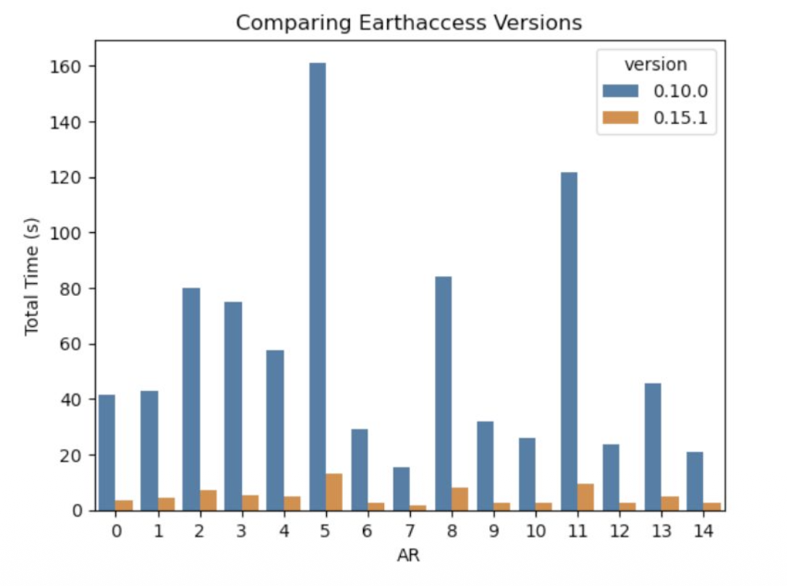

# Using old libraries

Software libraries are constantly making bug fixes, performance improvements, and adding new features. By using old versions of libraries, you may be missing out on key improvements that could greatly increase your product. Most open source libraries maintain a changelog or release notes where you can review what's included in new releases. For example, check out [Zarr's](https://zarr.readthedocs.io/en/stable/release-notes.html), [Xarray's](https://docs.xarray.dev/en/stable/whats-new.html), and [GDAL's](https://github.com/OSGeo/gdal/blob/master/NEWS.md).

For example, the following figure from [James Butler's 2025 AGU presentation "Cloud-based Workflows for Antarctic Atmospheric Rivers: Successes and Challenges](https://zenodo.org/records/17926811)" shows the impact on performance of upgrading from earthaccess v0.10 to v0.15:

